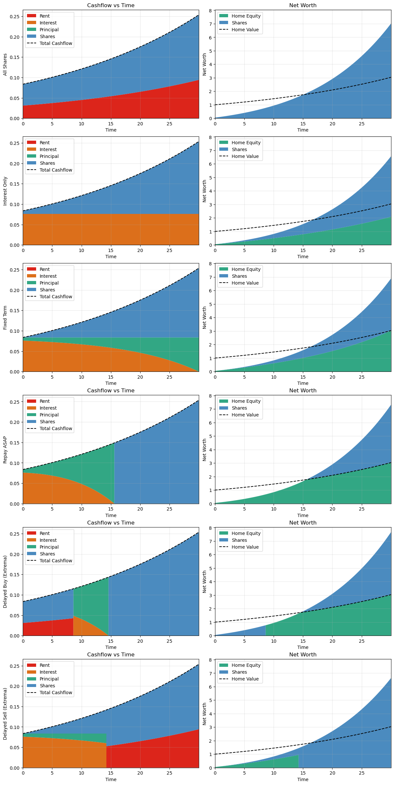
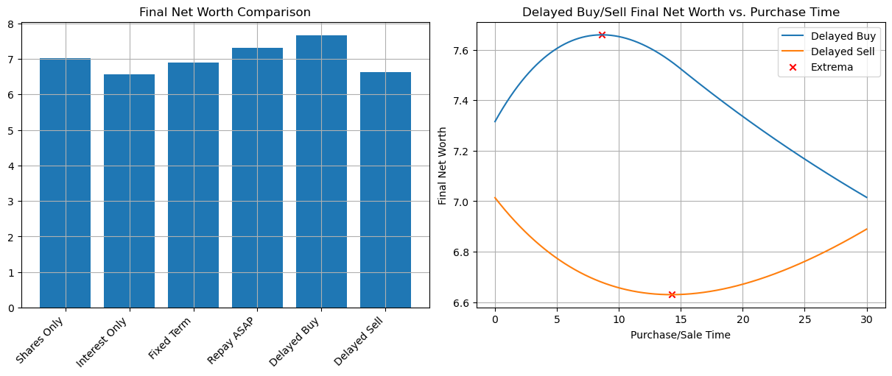
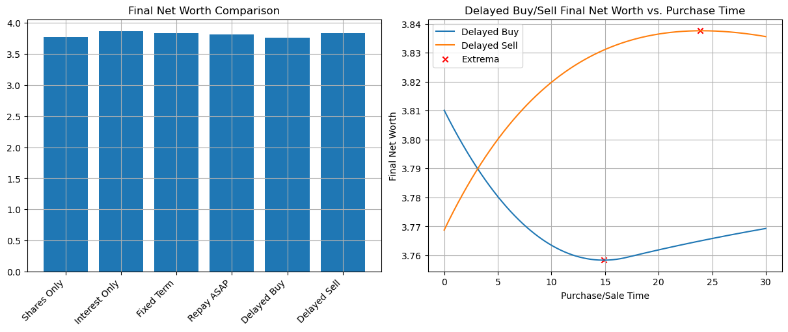
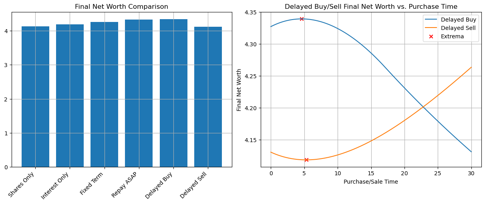

# Investors Aren't Ruining Australia's Housing Market: The Tax System Is

_A Graphical Walkthrough of the Australian Housing Market Distortions Caused by the CGT Discount_

I really don't think you understand how ridiculous Australia's capital gains tax (CGT) discount is. I say that as someone who's railed against it in the past yet who, until setting out to write this article, still didn't understand quite how ridiculous it is. I thought it was just a regressive tax break that disproportionately benefitted richer households. It is that - but it's also so much worse.

Australia's housing market no doubt has supply and demand mismatches contributing to the current affordability crisis. Even if these issues are resolved however, the current tax settings mean owning your own home will be a luxury in all but the most extreme macro-economic circumstances, poor and rich alike. Assuming nothing more than sustainable rental growth and market efficiency, I'll show that for rational investors interested solely in maximizing after tax returns, residential real estate should only ever be purchased by those with the highest income, and that even for these people home ownership is generally a poorer financial decision than investing in a rental property and renting elsewhere.

I'll also show that the myriad of first home buyer grants do nothing to change any of the above factors. Specifically, I'll show that at market equilibrium, access to larger loans only enables poorer financial decisions, and that shared equity schemes at best encourage only short-term owner-occupier investments, after which point recipients are better off selling and renting. In almost all cases where the recipients are eligible, taking advantage of these schemes leaves them worse off financially.

Now I understand big equations with lots of Greek symbols scare a lot of people, so I've done my best to minimize these in the body of this article. I've included a summary of [symbols](#symbols) and [equations](#equations) in the [appendix](#appendix). Code to generate the figures is publicly available on [github](https://github.com/jackd/cgt-discount-distortions).

As with everything I write, this is not financial advice. I'm not a financial adviser - just a guy on the internet who isn't afraid of numbers trying to understand the absurdity of Australia's housing market.

## Capital Gains Tax Discount Overview

Let's begin with an overview of the capital gains tax discount and the effect of negative gearing. If you're already familiar with how these policies work and interact with each other, feel free to skip to [the equilibrium housing market](#an-undistorted-equilibrium-housing-market-model) section, though it may be worth while making sure you understand the graphs in this section.

### A Progressive Base Tax System

Australia advertises itself as having a progressive tax system, meaning those with a higher income pay a higher proportion of their income in tax. This is implemented with a series of marginal tax rates where income at different levels is taxed at different rates. There aren't any silly shenanigans whereby earning more income can push you into a higher tax bracket and result in lower take-home pay.

_Income breakdown_

For this work we'll use the following tax brackets based on those given at [moneysmart.gov.au](https://moneysmart.gov.au/work-and-tax/income-tax) (I'm including the 2% medicare levy for all brackets above $18,200 for simplicity - in reality the [levy reduction threshold](https://www.ato.gov.au/individuals-and-families/medicare-and-private-health-insurance/medicare-levy/medicare-levy-reduction/medicare-levy-reduction-for-low-income-earners) is a bit more complicated, but it doesn't affect any of the qualitative points discussed and adds a lot of complexity).

| Income | Marginal Tax Rate incl. Medicare Levy|
|---|---|
|<\$18,200| 0%|
|\$18,201-\$45,000 | 18% |
|\$45,001-\$135,000| 32% |
|\$135,001-$190,000| 39% |
|\$>190,000        | 47% |

We can visualize these brackets and the resulting average tax rate for all income levels.

_Tax rates vs income_

In this context, a progressive tax system is one where the average tax rate increases as income increases - i.e. the orange line goes up as it goes to the right.

### Not All Income Is Equal

The capital gains tax discount was introduced after the [1999 Ralph Review](https://web.archive.org.au/awa/20180316084448mp_/http://rbt.treasury.gov.au/publications/paper4/download/Overview.pdf) suggested it would spur investment in risky assets. Specifically, it allows income derived from selling an asset for more than it was purchased to be discounted by 50% before any tax calculations, so long as that asset was held for more than 12 months. As an example, if you bought a house for $1M and 2 years later sold it for $1.1M, you would have a capital gain of $100,000, but that would only count as $50,000 (50% of $100,000) of taxable income.

If we think of people's income as a mix of regular income and capital gains, we can visualize the tax rates for different mixes.

_Average tax rates for different proportions of capital gains_

Now it's important to each of these lines still goes up as it goes right, meaning for any mix of regular income and capital gains constant across all incomes, the tax system is still progressive. All it shows is that incomes with a higher proportion of capital gains are taxed at a lower rate.

### A Regressive Example

In reality, it turns out that income type is not uniformly distributed over incomes, and those with higher incomes usually derive a greater proportion of that income from capital gains. To illustrate the effect of this, let's consider the extreme example where everybody with an income below $250,000 has 0% capital gains, and everyone's income beyond $250,000 is 100% capital gains.

_A regressive example_

In this context, beyond the $250,000 mark, the average tax rate decreases. This is an example of a regressive tax system, which is only possible due to the capital gains tax discount.

### Rational Agents and Effective Tax Rates

For the rest of this article, I'm going to assume all investors are rational agents motivated purely by after tax returns. We're going to assume all investment opportunities are deterministic with pre-tax returns known ahead of time with zero volatility. We're also going to assume the derived investment income is not large enough to push any agent into a different tax bracket. We'll talk in terms of _nominal tax rates_ (the marginal tax rate) and _effective tax rate_, which is the tax rate applied to a specific investment.

To illustrate this, consider the following plots relating nominal tax rates to after tax returns and effective tax rates for an investment that returns 6% in various compositions of regular income and capital gains.

_Nominal tax rates for investments with 6% pre-tax return_

All after-tax returns are downward sloping - meaning after-tax returns are lower for higher income earners, but the steepness of the line (the gradient) is less negative (more positive) for investments with a higher proportion of capital gains. In this case, the total pre-tax returns was the same (6%), so the lines all intersect at the 0% nominal tax rate.

From a rational agent's perspective, given a specific nominal tax rate, they want to choose the investment with the highest after-tax return - in this case, the 100% capital gains investment. In this context, that corresponds to the investment with the lowest effective tax rate, though this is a consequence of the choice rather than a factor that influences the choice itself.

### Do What the Rich do to Become Rich? Think Again

What if we consider a slightly more complex scenario where our agents are offered two possible investments: one with a regular yield (e.g. dividend or rental payments) of 8% but no capital gains, and another with a capital gain of 7% but no regular income.

_After tax returns for 8% yield vs 7% capital gain investments_

In this case, the optimal choice depends on that tax bracket. For those in the lowest two tax brackets, the investment with the higher base return is optimal, but for those in the higher tax bracket the capital gains discount makes the capital appreciating asset more attractive despite it's lower overall pre-tax return.

While this is a highly simplistic example, it illustrates a core characteristic of the effect of the capital gains tax discount. _It distorts the type of investments people should make depending on their marginal tax bracket_. Put another way, copying what the rich do won't necessarily make you rich.

### Maximizing Capital Returns Through Leverage

Things get murky when we throw in leverage, i.e. borrowing money to invest. Critically, the interest charged on investment loans is tax deductible, but the capital gains tax discount is _not_ applied to these deductions.

To illustrate this, let's consider and investment that returns 3% capital gains and 3% regular income, and a bank willing to loan us money at 6.5% interest with at least a 20% deposit. For this article we'll talk in terms of _leverage_ $\lambda$ being the value of the entire investment divided by the deposit. In this case, a 20% deposit corresponds to $\lambda=5$, a 50% deposit corresponds to $\lambda=2$, and an unlevered investment corresponds to $\lambda=1$.

Now based on those figures, with a combined return lower than the interest rate, you would be forgiven for assuming the optimal decision would be to invest your own money in the higher return investment but not take on a loan. If only things were that simple.

We can look at the after tax returns and effective tax rate paid for this investment at various leverage levels.

_Return/tax for leveraged investments_

Note these returns are for the initially deposited amount. If e.g. the a loan was initially taken out for a $\lambda = 5$ investment and enough of the principle was paid off over time such that $\lambda = 4$, the returns on the entire amount invested going forward would be consistent with the red line, not the orange.

Now there's no requirement for our leverage values to be whole numbers. We could repeat the above plot with an arbitrary number of lines corresponding to any leverage values between 1 and 5. This makes the figure messy quickly though, so instead we'll just be plotting the unlevered and maximally levered lines and shading in the area in between, remembering that any straight line passing entirely through the shaded region corresponds to a specific leverage value. We'll colour the shaded region such that it corresponds to the higher value for that tax rate.

_Return/tax for leveraged investments with all possible leverages_

Repeating the analysis we did above, we can see that the lowest two tax brackets should rationally choose to invest without leverage ($\lambda=1$), while the highest three tax brackets should choose to invest with maximal leverage ($\lambda=5$).

Digging deeper, we see that the highest two tax brackets get a better after-tax return than the 2nd and 3rd tax bracket, even assuming all agents act optimally. Even worse, the higher leverage after tax return lines have a positive gradient (go upwards when moving right). This corresponds to a _negative effective tax rate_. To understand why we have a negative effective tax rate, we can look at the proportion of total returns that's made up of capital gains.

_Capital gains proportion vs leverage_

As this shows, the capital gains proportion goes well past 100%. This is because interest payments are greater than non-capital returns on the investment. Now it's true that the government isn't _actually_ going to charge you negative tax - but so long as our agents have other income (potentially from other investments with a positive effective tax rate) to offset against, the effect is the same as far as this investment decision goes. See [this discussion in the appendix](#tax-neutral-weightings) for more details.

## An Undistorted Equilibrium Housing Market Model

Having discussed some of the oddities of the capital gains tax system, we're now going to forget all about those and introduce an equilibrium housing model in the _absence_ of such a discount. This is partly to simplify the introduction but also to give us something to compare to later when we [re-introduce the discount](#cgt-discount-distortions).

Rather than attempt to model price dynamics over time and responses to short term supply and demand issues or macro-economic shocks, we're going to focus on equilibrium pricing - i.e. the prices that result after the market has digested the effects these shocks.

For simplicity, we'll assume our investment universe can be boiled down to a choice between two assets: Australian residential real estate (a.k.a. housing), and some "other" investment which I'll be calling "shares" but in reality can represent some basket of any/all other assets.

With regards to housing, we assume:

- the rental market is sustainable, i.e. rents increase inline with wages at rate $w=3.7\%$ (from [treasury estimates](https://www.abc.net.au/news/2025-11-02/house-prices-climbing-for-generation/105954416));
- rental yields $y_h$ (net rental income after all non-capital expenses are paid as a fraction of property value) are constant;
- loans are available for both owner-occupiers and investment properties at the same rate $r$ up to some maximum leverage $\lambda = \lambda_m$ (we use $r=5.5\%$ and $\lambda_m=5$ unless otherwise specified);
- housing is sufficiently fungible that investors can purchase as much or as little as required; and
- there is never an issue getting a deposit together.

The first two assumptions imply that housing capital appreciation $c_h$ must be equal to wages growth $w$.

For our other/shares investment, we assume:

- a constant, known capital return rate $c_s$ and non-capital return rate $y_s$ (we use $c_s = 5\%$ and $y_s=3\%$ respectively);
- no leverage is available; and
- the market is sufficiently large and liquid that investments into this do not affect prices.

Finally, we assume that our rental yield is discovered by an efficient market made up of agents looking to optimize their after tax returns. To understand this better, consider the following return plots at different interest rates and rental yields.

_After tax return plots near market equilibrium_

The top row shows returns where interest rates are at 5.5%. On the left, the housing yield of 2.2% results in all housing investments (blue and orange lines) with a lower after tax return than the shares investment (green line). This should prompt rational housing investors to sell their properties and move the proceeds into shares. These sales will either lower the price of houses and/or indirectly increase the price of rent as competition in the rental market decreases. In either case, the future rental yields will be higher.

The top right shows the result of increasing the rental yield by a meager 0.2% to 2.4%. Now the levered returns on housing (orange line) is slightly above the shares returns (green), so rational shares investors will sell their shares and buy into the rental market. This has the opposite effect, reducing future rental yield.

Market equilibrium is the point we get to once these forces calm down and no agent gets any benefit from switching investments. For an interest rate of 5.5%, this is at a housing yield of around 2.3%, where the levered investment (orange) lies directly on top of the shares investment (green).

Since the returns of the levered housing investment (orange) are higher than the unlevered housing investment (blue), market participants are encouraged to remain maximally levered.

The bottom row shows returns when the market is near equilibrium with an interest rate significantly higher at 9%. In this case, the unlevered housing investment (blue) is better than the levered housing investment (orange), so equilibrium is when the unlevered curve (blue) overlaps the shares curve (green). At equilibrium it only makes sense to invest in housing over shares if you don't need to take out a loan.

In this context without a capital gains tax discount, there are only 2 qualitatively different regimes in which the market operates - a low interest and a high interest regime. Unsurprisingly, they cross over at the point where the interest rate equals the pre-tax return rate of the shares investment (8% in our case). At this interest rate, all three lines overlap at all points.

Now that we've covered what it means to be in equilibrium, let's take a closer look at these market equilibriums and consider what it means for owner occupiers. In Australia, primary residences are exempt from all capital gains, and the imputed rent (the rent you don't have to pay) can also be considered a tax free component of the return on investment. Interest paid on loans is not tax deductible however. The result of all of this is that owner-occupier returns can be considered the same as investment returns with a zero nominal tax rate.

Let's take a closer look at what this means in our low interest rate regime.

_Equilibrium returns at low interest rates. Dahsed lines on right correspond to shares returns. Dotted lines correspond to unlevered housing investments_

Here, the dotted lines on the left correspond to owner-occupier investments. You can consider the area between dotted lines shaded in the same way as the area between the dashed orange (underneath green) and blue lines, but I've decided not to include that because the figure is a already pretty busy. The plot on the right shows these returns against the amount of leverage for each tax rate. The black line - owner-occupier returns - overlaps the 0% housing investor returns line.

Clearly, the best investment for all non-zero tax brackets is fully levered owner-occupier housing (those in the zero tax bracket would be just as well off investing in shares). Each participant is limited to one main residence  however, so this won't affect the equilibrium definitions. If you can find a bank that will allow you to maintain a fixed leverage (or are happy to constantly bank-hop and refinance), that would be the choice - but in reality you're probably going to have to pay it all back at some point. This means moving through all leverage values from 5 down to 1. Looking at the plot on the right, if you can't refinance, the optimal plan would be to sell at the point the owner occupier line (black) intersects the share investment line (dashed) for your tax bracket. In this case, that implies those in the 0% tax bracket should just stick to shares, while those in the lowest non-zero tax bracket should sell once they have roughly half paid-off the property ($\lambda = 2$). Those in higher tax brackets are better off holding a paid off primary residence than investing elsewhere even if they can't maintain leverage.

Note that in this context, giving owner-occupiers the opportunity to purchase a house with more leverage would give lower income households the chance to make outsized returns in the housing market. For example, if a zero-tax bracket agent could get a loan with a 10% deposit (leverage $\lambda=10$), the initial return on investment of their deposit would be 10.5%. If they could get a loan with a 5% deposit (leverage $\lambda=20$) they would get an initial return on their deposited amount of 15.5%. Note this doesn't change the fact that they would still be better off selling their property once their equity stake reached more than 20% and investing the proceeds in shares.

Next let's consider the high interest case, where the interest rate $r = 9\%$.

_Equilibrium returns at high interest rates_

In this case, the optimal choice for agents is to have a fully paid off owner-occupied dwelling. If they don't have the capital to do a full cash purchase then their optimal choice depends on their tax rate. For those below the tax-free threshold, home with a loan of any size is suboptimal. For every other tax bracket their is a clear point at which point a levered owner occupied investment (black line on right) gives a superior return to shares (dashed lines). The policy would thus be to invest in shares until such a time as you had enough capital to purchase a home with this leverage, then pay it down as soon as possible.

Note that in this case, allowing larger loans for owner-occupiers wouldn't change the optimal policy - they would just extend the range of the sub-optimal option.

To summarize, without a capital gains tax discount, the optimal investment assuming unlimited capital is the same across all tax brackets. When capital is limited - e.g. because an agent does not have the funds to purchase a house outright - then then optimal behaviour depends on the interest rate. In low interest environments, leverage should be maximized, and if not possible capital should be moved out of owner-occupied housing once the level of debt drops below a critical point (dependant on tax rate). For high interest rate environments, owner-occupier investments should be delayed until a similar critical leverage point, again dependant on tax bracket, and paid off as far as possible once purchased.

While this might seem a little unfair - those in lower tax brackets either have to sell earlier or purchase later - it at least makes a degree of _sense_, and regardless of the interest rate there is at least some leverage value that makes an owner-occupied dwelling an optimal financial decision.

## CGT Discount Distortions

With that in mind, let's re-introduce the capital gains tax discount and see what our equilibrium market looks like. Starting with a high interest rate of 9%.

_Returns with CGT discount and 9.0% interest_

Compared to the undistorted versions above, there are three main differences worth noting. Firstly, our shares investment now only overlaps our housing investment at a single point: maximally leveraged housing in the highest tax bracket. The second critical difference is the slope of the leveraged housing investment (orange line) is now positive - indicative of a negative effective tax rate. This explains the first point: negative tax rates give the highest taxed agents the greatest advantage. The final point of interest is that the housing investment lines intersect between the last two tax brackets. This indicates that if for whatever reason agents in the lower tax brackets didn't want to invest in shares, they'd be better off purchasing unleveraged investment properties - very different to agents in the highest tax bracket who get a slightly higher after tax return from maximally leveraged investment properties.

Additionally, it's worth pointing out that the equilibrium housing yield is 3.9%, down from 4.3% in the no CGT discount case. Proponents of the scheme would claim this is a 10% drop in rent - detractors that it's a 10% inflation of housing prices. This article makes no comment as to which of these it is.

Despite all this, owner-occupied investments are still viable for all but the lowest tax bracket agents who are still best served by sticking to shares. However, maximally leveraged owner-occupier returns are dismal at just 2%. Maybe that's not all too unsurprising in a high-interest world however.

Let's see what happens when we drop the interest rate a bit.

_Returns with CGT discount and 7.0% interest_

At 7% interest we see the same major features as in the 9% case. At this point, it no longer makes financial sense for anyone in the bottom three tax brackets to own their own home. For those in the top two tax brackets, owner-occupied investments are still optimal financial choices, but only they are bought with small loans - virtually loan-free for the 39% bracket, and around a third of the property value for the highest income agents.

This is where it also becomes apparent that the fully-leveraged owner-occupier investment still returns a dismal 2% yield - identical to the higher interest rate case. In fact, the maximally leveraged investment property returns (orange line) hasn't moved at all. This was one of the most surprising findings I made doing this modelling - that the equilibrium condition for almost all reasonably parameter estimates resulted in this phenomenon. I don't have a good intuitive explanation other than to say that's the way the maths pans out.

_Returns with CGT discount and 6.2% interest_

6.2% interest is the highest realistic interest rate that it makes financial sense for anyone to their own home - and even then, only those in the highest tax bracket. Beyond this, its financial optimal for the richest to own all properties and rent them out to everyone else. By that, I don't mean it's financially optimal just for the rich - it's financially optimal for _everyone_.

_Returns with CGT discount and 5.5% interest_

At 5.5% interest rate, equilibrium rental yield is down to 1.1% - less than half of the 2.3% in the undiscounted case with the same interest rate. At this point though, with home ownership being such a poor option financially, it's highly questionable the extent to which this lower rental yield manifests itself in lower rents as opposed to higher property prices.

_Returns with CGT discount and 2% interest_

We're pushing the bounds of believability with 2% interest rates, but I bring it up because this is the point at which our owner-occupier returns versus leverage (black line, right plot) is flat. Any interest rate lower than this and it will start going uphill. This is significant, because that's the first point at which allowing larger leverages can possibly result in better financial outcomes for participants. I will note however that the equilibrium rental yield at this point is -1.69%. This is net of maintenance costs, management fees and other premiums, taxes, and expenses, so it's at least conceptually possible that landlords aren't actually paying renters, but I'll accept we're pushing the limits of our assumptions here.

## Discount Distorted Phenomena

It's worth pointing out two distinct distortions the CGT discount introduces.

### High vs Low Interest Rates

There is an analogue of the high vs low interest rate regimes in the undistored (no CGT discount) case. Recall that if the interest rate for greater than the pre-tax return on shares (8% with our figures), then housing market participants (both investors and owner occupiers) were better off paying down their mortgage. Interest rates below that level meant optimal behaviour was to stay as leveraged as possible. This makes sense: if the return you can get on some investment is less than the interest rate your paying on a loan, you'd be wise to pay off the loan before putting anything into the alternative investment.

With the capital gains tax discount, we could say the analogue for owner occupiers is the point at which paying off the mortgage makes the overall housing investment better or worse. Graphically, this is the point where the blue and orange lines intersect at 0% nominal tax rate. As shown above, that's ridiculously low - around 2%. Historically, the only [record](https://www.rba.gov.au/statistics/tables/#:~:text=Housing%20Lending%20Rates%20%E2%80%93%20F6) I can find of rates this low were just after covid, and even then only on very restrictive products. Even these never dropped below 2%, nor did they stay at these levels for long.

Note that only in the low interest environment does giving home owners access to larger loans improve the returns of the investment. Given the infeasibility of such low interest rates under these model assumptions, this suggests increasing potential leverage will always result in worse financial outcomes for recipients.

### Ownership Optimality

In the undistorted case, an owner-occupier investment was always optimal - either maximally leveraged in the low interest case, or fully paid off when interest rates were high. Sure, most people don't have the funds to purchase a home outright, so under high interest rates people may not be able to realize that investment, but there was always a critical amount of leverage that made owning your own home optimal.

_This is not the case with a capital gains tax discount_. Graphically, this can be seen in cases where the blue dotted line is above the green dot in the appropriate tax bracket. At interest rates above 8.25%, full paid off home ownership is a good investment for all but those in the tax free bracket. Lower than 8.25% however, home ownership is no longer an optimal financial decision for those in the 18% tax bracket. At 7.3%, those paying 32% tax suffer the same fate, and by 6.3% even those in the highest tax break after better off selling up and purchasing an investment property and/or shares.

#### Optimality, not Affordability

It's important to note this whole article relates to optimizing financial decisions relating to housing, not on housing affordability. If Thanos snapped his fingers and half the population disappeared, the survivors - distraught as they would be - might find some small comfort in more affordable housing. This would affect both rents and house prices however, and once the market had adapted to the shock and returned to equilibrium, the dynamics and optimal investment policies described in this article would be no less true.

## Where Are We Now?

The RBA's official cash rate is currently 3.6%, with home loans sitting around 2% above that. Most economists expect that to either remain the same or drop by potentially 0.25% next year. This is also close to the [neutral rate estimates](https://www.rba.gov.au/publications/smp/2024/aug/financial-conditions.html). This puts us solidly in the higher interest rate regime, with all owner-occupied investments distinctly suboptimal under the sustainability/equilibrium assumptions of the model.

Now "under the sustainability/equilibrium assumptions" is a very large asterisk, and I'm not trying to say we're currently there. This model makes no attempt to deal with supply or demand shocks like the immigration-induced wave of demand Australia has faced since reopening borders. In the short term, residential real estate investments may very well out-perform. This article says nothing about how we get to equilibrium - just the destination we're headed towards.

In short, we may not be at equilibrium now, and I can't say how fast we're going - but it is the inevitable destination.

## Government Interventions

### 5% Deposit Scheme

As the name suggests, the [5% deposit scheme](https://firsthomebuyers.gov.au/australian-government-5-percent-deposit-scheme) gives first home owners the chance to buy their own home with a 5% deposit (or 2% for single parents) while the government covers the insurance cost.

As discussed above, the only circumstance in which accessing a greater deposit for owner occupiers will result in a better financial outcome is if interest rates are unrealistically low for the duration of the loan - and even then, returns will only be better than shares while leverage is maintained. If a repayment schedule is enforced that eventually results in the home being paid off, optimal behaviour would be to purchase the home until some critical leverage value is reached, then sell out and return to renting.

### Help to Buy / Shared Equity Scheme

The [help to buy scheme](https://firsthomebuyers.gov.au/australian-government-help-buy-scheme) involves the government co-owning housing with first home buyers, stumping up 30% (or 40% for new builds) of purchase price and requiring only a 2% deposit ($\lambda=30$ or $35$ in our model).

There are very narrow circumstances in which these might help first home buyers into housing. Below are the returns when interest rates are at 6%.

_Shared equity returns vs. leverage with interest rates at 6%_

The negative slope of the brown line (returns with 30% government equity) that this investment gets better as you pay off the loan. For highest tax bracket owner-occupiers, optimal behaviour is to buy in at a leverage of around 3.5. For those in the 39% tax bracket, buying your own home with this scheme is only close to financially optimal the remaining 70% can be bought without a loan. Having said that, people in either of these tax brackets are ineligible for the scheme. Eligible participants are all in a tax bracket that would make this utilizing this scheme suboptimal.

The 40% co-ownership line is slightly better. It's sloping up, indicating that participants want to remain as highly leveraged as possible. For those in the lowest tax bracket, this is an optimal investment until the leverage reaches $\lambda=10$. Note that because the government owns 40%, this corresponds to an equity amount of 6% of the purchase price of the home. For those in the 18% tax bracket, this investment remains optimal until $\lambda=5$ or an equity stake of 10% of the value of the home. Those in the 32% tax bracket may benefit from holding this property even once it's paid off, though note the higher income earners in this bracket are ineligible for the scheme.

### 25% CGT Discount

Reducing the capital gains tax discount to 25% has been considered by [government](https://www.pbo.gov.au/sites/default/files/2023-03/PER414%20%20ALP%20%20Negative%20gearing%20and%20capital%20gains%20tax%20CGT%20reform.PDF) and recommended by [the Grattan Institute](https://grattan.edu.au/wp-content/uploads/2023/04/Grattan-Back-in-Black-1.pdf). This lessens the distortions, and under the other model assumptions used here means housing investors end up with a very slightly positive effective tax rate. Under the current interest rate of 5.5%, this makes levered home ownership optimal for people in the highest tax bracket, and fully paid off home ownership optimal for those in the second highest tax bracket.

_Returns with 25% CGT discount and 5.5% interest_

This will obviously encourage home ownership beyond what's implied by the current system, but the slice of the population that's viable for (people earning over $135,000-$190,000 who can afford to buy a home outright, or those earning more than $190,000) is fairly slim.

## What if I'm Talking to a Normal Human?

Now all this is well and good, but when the discussion comes up in the pub, pulling out graphs and discussing gradients and intercepts isn't going to win over many people. Trust me, I've tried. In this section I'll try and distill what the above says into an elevator pitch without pictures or the accompanying 5,000 word essay.

### The CGT Discount is a Tax Discount in Name Only

On an investment basis, the CGT discount and negative gearing result in housing investors having a negative effective tax rate. We don't normally talk about negative tax rates - we call them subsidies. The higher the investor's nominal tax rate, the larger the subsidy. This means the highest tax rate investors can out-compete all lower tax rate participants when using leverage. Assuming there is another asset class where this advantage doesn't exist, investors not in the highest tax bracket will always be better off (in expectation) opting for the other investment.

### Lower Interest Rates Don't Increase Affordability

For those yet to enter the housing market, lower interest rates drive more capital into the market from investors. Regardless of whether this drives up prices on existing properties or lowers rent by increasing supply, the end result is a lower return for prospective owner-occupiers.

### More Leverage Won't Fix Things

Increasing leverage for investors exacerbates the problem - that should come as no surprise. However, increasing leverage for owner occupiers _also_ makes the financial decision worse except under extremely low interest rates that have only been seen in Australia once (immediately after covid hit) and were never intended to last long.

### This isn't Irrational Exuberance

It's tempting to look at a market where renting is always preferable to buying and dismiss it as the result of irrational exuberance, FOMO, property speculators and/or ponzinomics that will eventually collapse. The reality is worse. Rational behaviour of all agents purely motivated for financial gain with Australia's tax settings would result in 0% home ownership under neutral interest rates.

### Home Ownership Is a Luxury

There are certainly non-financial benefits to owning your own home. I haven't discussed these non-financial benefits throughout this paper, but that does not mean they don't exist. In reality, many people will buy their home despite it being suboptimal financially. I'm not saying that's a bad idea - just that it's potentially expensive. Luxury cars are expensive, but that doesn't stop people buying them. Maybe think twice before taking out a loan with a 5% deposit to purchase one though.

### Housing Swaps: Ownership with Extra Steps

If you're in the top tax bracket, and you have a friend in the top tax bracket, at some point you'll be better off buying their property and renting it to them, and letting them buy your property and renting it off them. I'm not saying this is a good outcome - but it's the outcome we deserve for electing politicians who refuse to fix the system.

## Conclusions

That was really long. Thanks for sticking with me - it was a much deeper rabbit hole than I expected it to be. If that's still not enough, I've included some more [figures](#figures-that-didnt-fit) below that I generated but didn't quite fit the narrative. Enjoy.

## Appendix

### Symbols

|Symbol|Default Value|Description|Source|
|-----|-----|---|---|
| $w$       | $3.7\%$    | Wage growth inflation                                 | [Treasury estimates quoted by ABC](https://www.abc.net.au/news/2025-11-02/house-prices-climbing-for-generation/105954416)
| $c_h$     | $w$       |Housing capital appreciation                          | Steady state implications|
| $y_h$     |           |Housing rental yield                                  |            |
| $y_h^*$   |           |Equilibrium housing rental yield                      | Market equilibrium assumption |
| $c_s$     | $5\%$     |Shares capital appreciation                           | Made it up |
| $y_s$     | $3\%$     |Shares dividend yield                                 | Made it up |
| $\lambda$ |           |Loan leverage, e.g. 20% deposit implies $\lambda = 5$ |            |
| $\lambda_m$| $5$      | Maximum leverage available to investors              |            |
| $i$       | $5.5\%$   | Interest rate                                        | [CommBank](https://www.commbank.com.au/home-loans.html)                |
| $\Delta$  | $0.5$     | Capital gains tax discount                           | [ATO](https://www.ato.gov.au/individuals-and-families/investments-and-assets/capital-gains-tax/cgt-discount) |
| $t$     | [See table](#a-progressive-base-tax-system) | Nominal marginal tax rate                                        |  |
| $t_m$     | $47\%$ | Highest nominal tax rate                                        |  |
| $R_o$     | | Total home owner return | |
| $R_h$     | | Total non-owner-occupier housing investor after-tax return | |
| $R_s$     | | Total share investor after-tax return |  |

### Equations

General after tax levered returns

$$
R(\lambda, t; c, y, r) = \lambda [(1 - (1 - \Delta)t)c + (1 - \Delta)y] - (1 - \lambda)(1 - t)r
$$

Investment housing returns:

$$
R_h(\lambda, t; r) = R(\lambda, t; c_h, y_h, r)
$$

Shares returns:

$$
R_s(t) = R(1, t; c_s, y_s, 0)
$$

Owner occupier housing returns:

$$
R_o(\lambda; r) = R_h(\lambda, 0; r)
$$

Steady state implications:

$$
c_h = w
$$

Market equilibrium:

$$
y_h^* = y_h \text{ such that } R_h(\lambda_m, t_m) = R_s(t_m)
$$
which after substitution yields

$$
y^{*}_{h} = \frac{- \Delta c_{s} t_{m} + \Delta \lambda_{m} t_{m} w + c_{s} t_{m} - c_{s} - \lambda_{m} t_{m} w + \lambda_{m} w + r \left(\lambda_{m} t_{m} - \lambda_{m} - t_{m} + 1\right) + t_{m} y_{s} - y_{s}}{\lambda_{m} \left(t_{m} - 1\right)}
$$

### Figures That Didn't Fit

#### Cashflow Simulations

I'm sure at least a few of you think I've forgotten about rent or made some other rookie error that means everything above is wrong. As a sanity check, below are some simulations of agents taking different options. I consider several simulations over a 30 year time horizon:

1. _Shares only_: rent forever and use remaining cashflow for shares
2. _Interest only_: purchase property initially, pay interest only on the loan and use remaining funds to buy shares
3. _Fixed term_: purchase property initially and pay off using a standard 30 year mortgage repayments
4. _Repay ASAP_: purchase property initially and pay off the mortgage with all available cash.
5. _Delayed buy_: initially rent/invest in shares until leverage crosses the critical point where owner-occupier returns equal share investment returns, then purchase property and pay off ASAP.
6. _Delayed sell_: purchase property initially and pay off based on a standard 30 year mortgage, but sell once owner-occupier returns equal share investment returns.

In all cases, the total cashflow available was set to the fixed term repayments, growing by wage growth over time. All cashflow remaining after rent/repayments was invested in shares.

Below are the results for a 5% deposit at 8% interest rate for someone in the 39% tax bracket. In all cases, cashflows are in units of the original house value per year, and all final net worths are similarly scaled to the initial value of the dwelling.

_Cashflow and net worth for 5% deposit, 8% interest rate and 39% tax bracket agent_

_Final net worth summary_

As expected, delaying purchase until reaching the critical leverage value (1.8 in this case) gives the best result.

We get the following results for the shared equity scheme with 40% government ownership, 2% deposit and an interest rate of 6% at tax bracket 32%.

_Final net worth summary for 40% government shared equity, 6% interest, 2% deposit and 32% tax rate_

In this case, optimal behaviour is to purchase initially and pay off as slowly as possible. Compared to a fixed term mortgage that requires the loan to be paid down, there is a tiny financial benefit to selling after the loan is paid down to the critical level and reverting to renting, though in all cases here the differences in final net worth are pretty negligible.

_Final net worth summary for 30% government shared equity, 6% interest, 2% deposit and 39% tax rate_

As discussed above, when we drop the government share to 30%, those in the second top tax bracket benefit very slightly from buying in at the appropriate time and paying off the remaining loan ASAP.

#### Tax Neutral Weightings

For investors in the top tax bracket, property ownership has a negative effective tax rate (orange lines have positive gradient). To realize this negative effective tax rate, the agent needs income from another source. In the below plot, we consider a portfolio made up of $\alpha$ shares and $(1 - \alpha)$ in maximally leveraged real estate (resulting in $\lambda(1-\alpha)$ total pouring into property).

_Tax neutral portfolio weighting_

It shows that with default parameters, having 57% or more invested in shares results in an average tax rate of 0%. A higher weighting would give the same after tax return, though less would require more income to offset, e.g. from a salary.

#### Required Leverage For All Interest Rates

_Required leverage values for equal home ownership and shares returns_

The above shows the conditions for which an agent would prefer to purchase their own home compared to investing in shares. Any point below and right of the relevant tax bracket line would be better off in home ownership. Fo Example, at 8% interest, agents in the 32% tax bracket would only buy their home if they had the capital to use $\lambda < 1.5$, while those in the 39% tax bracket would buy in around $\lambda = 1.8$. The lower tax brackets would never purchase their own home at this interest rate if acting financially optimally.

#### When Optimizing Returns Means Minimizing Tax

Here we consider the after tax returns of an agent offered two investments: a base investment returning 5% capital gains and 3% regular income, and a potentially levered investment returning 3% capital and 3% regular income with interest charged at 6.5%. The agent can take any amount of each asset, but their average tax rate over the weighted investment must be non-negative.

_Returns for a weighting of two investments constrained to having a non-negative average tax rate_

In this case, returns are optimized on the zero effective tax frontier. This feels like a quadratic programming problem, and there are probably conditions under which return maximization coincides with tax minimization which could be interesting to explore... but that's a project for another time.
